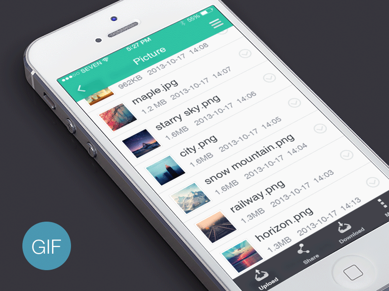

# Sliding Drawer Menu

Android Library providing menu below content styled sliding menu.



## Getting Started

Add library to your gradle:
```
implementation 'com.czerwii:SlidingdrawerMenu:1.0.1'
```
Or using maven:
```
<dependency>
  <groupId>com.mobeedev</groupId>
  <artifactId>SlidingdrawerMenu</artifactId>
  <version>1.0.`</version>
  <type>pom</type>
</dependency>
```
### Installing

Start by injecting menu View:
```
   slidingNavigation = SlidingMenuBuilder(ACTIVITY)
                .withMenuOpened(false)
                .withContentClickableWhenMenuOpened(false)
                .withSavedState(savedInstanceState)
                .withMenuLayout(MENU_LAYOUT)
                .withToolbarMenuToggle(toolbar)
                .inject()
```
Use `SlidingNavigation` to get all control you need over menu:
```kotlin
SlidingNavigation {
    fun isMenuClosed(): Boolean
    fun isMenuOpened(): Boolean
    fun isMenuLocked(): Boolean
    fun getLayout(): SlidingNavigation // if you need specific control over menuView
    fun closeMenu()
    fun closeMenu(animated: Boolean)
    fun openMenu()
    fun setMenuLocked(locked: Boolean)
    fun openMenu(animated: Boolean)
}
```

You can customize all options in `SlidingMenuBuilder`.

#### Transformations
You can change menu transformations using `SlidingMenuBuilder`.

```kotlin
SlidingMenuBuilder(this)
  .withDragDistance(140) //Horizontal translation of a view. Default == 180dp
  .withRootViewScale(0.7f) //Content view's scale will be interpolated between 1f and 0.7f. Default == 0.65f;
  .withRootViewElevation(10) //Content view's elevation will be interpolated between 0 and 10dp. Default == 8.
  .withRootViewYTranslation(4) //Content view's translationY will be interpolated between 0 and 4. Default == 0
  .addRootTransformation(customTransformation)
  .inject();
```
#### Menu behavior
Control all menu behavior

```java
new SlidingMenuBuilder(this)
  .withMenuOpened(true) //Initial menu opened/closed state. Default == false
  .withMenuLocked(false) //If true, a user can't open or close the menu. Default == false.
  .withGravity(SlideGravity.LEFT) //If LEFT you can swipe a menu from left to right, if RIGHT - the direction is opposite. 
  .withSavedState(savedInstanceState) //If you call the method, layout will restore its opened/closed state
  .withContentClickableWhenMenuOpened(isClickable) //Pretty self-descriptive. Builder Default == true
```

## Sample/Example
If you need an example please checkout [sample app](sample/src/main/java/com/mobeedev/slidingdrawermenu)

## Contributing

Feel free to create PR. I'll try and comment/check/merge all functionality.

If you have any Problems/bugs please file an issue. All issues must describe their problem in depth that will allow me to fix it. Failing to do that will result in me not knowing how to help you, all such issues will be closed. Other then that I;m always happy to help. Contact me at czerwiiii@gmail.com

## Versioning
`publishVersion = 1.0.0`

## Authors

* **Szymon Kraus** - *Other Projects* - [MoBeeDev](https://mobeedev.com)

* **Seven Yu** - Big thx for the beautiful gif presenting functionality  *Seven Yu Projects* - [Behance](https://www.behance.net/joodu) , [Twitter](https://twitter.com/se7enyu)

## License
```
Copyright 2017 Szymon Kraus

Licensed under the Apache License, Version 2.0 (the "License");
you may not use this file except in compliance with the License.
You may obtain a copy of the License at

http://www.apache.org/licenses/LICENSE-2.0

Unless required by applicable law or agreed to in writing, software
distributed under the License is distributed on an "AS IS" BASIS,
WITHOUT WARRANTIES OR CONDITIONS OF ANY KIND, either express or implied.
See the License for the specific language governing permissions and
limitations under the License.
```

Full license can be found at [License](https://github.com/czerwix/SlidingDrawerMenu/blob/master/LICENSE)

## Acknowledgments

* Hat tip to anyone who's code was used
* MeetingApplication
